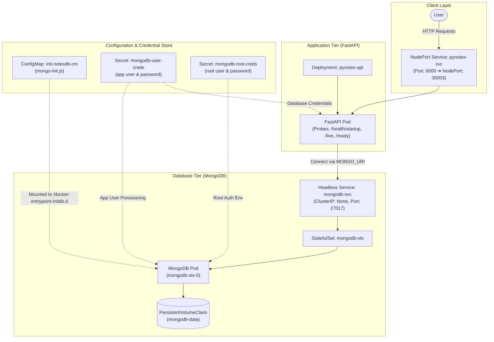

# PyNotes: Two-Tier Containerized Application Deployment in Kubernetes (FastAPI + MongoDB)

[](https://fastapi.tiangolo.com)
[](https://www.python.org)
[](https://www.mongodb.com)
[](https://www.docker.com)
[](https://kubernetes.io)
[](https://github.com/GoogleContainerTools/distroless)
[](https://www.linkedin.com/in/narenpradhan)

A practical, two-tier note-taking application designed for hands-on **Docker**, **Containerization**, and **Kubernetes** deployment practice. The project features an asynchronous **FastAPI** backend and a persistent **MongoDB** database, demonstrating container optimization, multi-stage builds with Google Distroless runtime, and Kubernetes orchestration patterns on Minikube.


## Table of Contents

- [Project Overview](#project-overview)
- [Application Architecture](#application-architecture)
- [Project Structure](#project-structure)
- [Environment Variables](#environment-variables)
- [API Endpoints & Overview](#api-endpoints--overview)
- [Running the Application with Docker Compose](#running-the-application-with-docker-compose)
- [Hands-on DevOps Tasks Roadmap](#hands-on-devops-tasks-roadmap)
- [Connect with Me](#connect-with-me)
- [Copyright & Usage Notice](#copyright--usage-notice)


## Project Overview

### Introduction
**PyNotes** is a decoupled two-tier application built to provide a realistic, lightweight backend service for practicing modern container workflows and orchestration. Rather than working with hypothetical architectures, this repository provides both application source code and full orchestration manifests to observe how an asynchronous API interacts with stateful persistent storage across local containers and Kubernetes clusters.

### Key Features
- **Asynchronous Architecture**: Fully non-blocking I/O operations using FastAPI and the `motor` asynchronous MongoDB driver.
- **Native Kubernetes Health Probes**: Dedicated `/health/live`, `/health/ready`, and `/health/startup` probe endpoints with real database connectivity checks.
- **Optimized Distroless Containers**: Multi-stage Docker build utilizing Google Distroless runtime to strip package managers, shells, and non-essential dependencies.
- **Stateful Database Management**: MongoDB deployment using a Kubernetes `StatefulSet` with dynamic persistent volume claims.
- **Decoupled Credentials**: Separation of root database administration credentials from application-scoped user credentials via Kubernetes Secrets.

### DevOps & Containerization Concepts Covered
- **Docker**:
  - Single-stage baseline containerization.
  - Multi-stage builds separating build tools from minimal runtime artifacts.
  - Distroless runtime hardening for reduced attack surface and smaller image footprints.
  - Docker Compose multi-service networking and named volume management.
- **Kubernetes**:
  - Deployment for stateless API pods with rolling updates and resource limits.
  - StatefulSet for stateful database pods requiring stable network identities and dedicated storage.
  - Headless Service for internal DNS-based stateful pod discovery.
  - NodePort Service for exposing the application external to the Minikube cluster.
  - ConfigMap for mounting database initialization JavaScript files dynamically.
  - Secret for secure injection of database usernames and passwords.
  - Health check probe configurations (`startupProbe`, `livenessProbe`, `readinessProbe`).


## Application Architecture

The following diagram illustrates the end-to-end traffic flow and component hierarchy across the two tiers in Kubernetes:



### Architecture Highlights:
1. **Traffic Entry**: External HTTP requests enter through the `pynotes-svc` NodePort service (port `30003`) which routes traffic to the active FastAPI container pods.
2. **Stateless API Layer**: The `pynotes-api` deployment manages stateless pods governed by CPU/Memory resource constraints and native health probes.
3. **Internal Service Discovery**: The application communicates with MongoDB through the headless service `mongodb-svc.default.svc.cluster.local:27017`.
4. **Stateful Database Tier**: MongoDB runs within a `StatefulSet` attached to a persistent volume (7Gi) via `volumeClaimTemplates` to guarantee data persistence across pod restarts or rescheduling.
5. **Dynamic Initialization**: On initial startup, the MongoDB pod executes the mounted `mongo-init.js` from the ConfigMap, creating the scoped application database user.


## Project Structure

```
DevOps-Prac-v1/
├── app/
│   ├── __init__.py               # Application package definition
│   ├── database.py               # Asynchronous MongoDB client (motor) & atomic ID generator
│   ├── models.py                 # Pydantic schemas (NoteCreate, NoteResponse, etc.)
│   ├── routes.py                 # REST API endpoints
│   └── main.py                   # FastAPI entrypoint, lifespan events, and health probes
├── k8s-deployment/
│   ├── init-notesdb-cm.yaml      # ConfigMap mounting mongo-init.js initialization script
│   ├── mongodb-root-creds.yaml   # Secret for MongoDB administrative root credentials
│   ├── mongodb-user-creds.yaml   # Secret for scoped application database credentials
│   ├── mongodb-svc.yaml          # Headless Service for MongoDB pod discovery
│   ├── mongodb-sts.yaml          # StatefulSet definition with volumeClaimTemplates
│   ├── pynotes-api.yaml          # Deployment definition with resource limits & health probes
│   └── pynotes-svc.yaml          # NodePort Service exposing the API on port 30003
├── .dockerignore                 # Excluded build artifacts and local virtualenvs
├── .env.example                  # Template for local environment variables
├── Dockerfile                    # Production multi-stage build using Google Distroless runtime
├── Dockerfile.standard           # Baseline single-stage build for learning and comparison
├── docker-compose.yml            # Multi-container orchestration (FastAPI + MongoDB)
├── requirements.txt              # Application Python dependencies
├── TASKS.md                      # Phased hands-on practice roadmap and challenge checklist
└── README.md                     # Documentation
```


## Environment Variables

The application configures its database connection and server parameters via environment variables:

| Variable | Default Value | Description |
| :--- | :--- | :--- |
| `MONGO_URI` | `mongodb://localhost:27017` | Full MongoDB connection string (including credentials and database name) |
| `DATABASE_NAME` | `notes_db` | Name of the target MongoDB database |
| `PORT` | `8000` | Port for the Uvicorn web server |
| `HOST` | `0.0.0.0` | Binding host address |


## API Endpoints & Overview

### Entity Schema (`Note`)
- `id` (*string*): 3-digit sequential identifier (e.g., `"101"`, `"102"`).
- `title` (*string*): Title of the note (1 to 200 characters).
- `content` (*string*): Detailed body of the note.
- `created_at` (*datetime*): UTC creation timestamp.
- `updated_at` (*datetime, optional*): UTC update timestamp.


### Endpoints Summary

| Method | Endpoint | Description | Expected Status |
| :--- | :--- | :--- | :--- |
| `GET` | `/health` | General application health status | `200 OK` |
| `GET` | `/health/live` *(or `/livez`)* | **Liveness Probe**: Confirms the process is running | `200 OK` |
| `GET` | `/health/ready` *(or `/readyz`)* | **Readiness Probe**: Verifies database connection | `200 OK` / `503 Unavailable` |
| `GET` | `/health/startup` *(or `/startupz`)* | **Startup Probe**: Verifies initial startup lifecycle | `200 OK` / `503 Unavailable` |
| `POST` | `/notes` | Create a new note (auto-assigns sequential 3-digit ID) | `201 Created` |
| `GET` | `/notes` | Retrieve all notes (sorted latest first) | `200 OK` |
| `GET` | `/notes/{id}` | Retrieve a specific note by ID | `200 OK` / `404 Not Found` |
| `PUT` | `/notes/{id}` | Update note title or content | `200 OK` / `404 Not Found` |
| `DELETE` | `/notes/{id}` | Delete a note by ID | `200 OK` / `404 Not Found` |


### Sample `curl` Requests & Responses

#### 1. General Health Check (`GET /health`)
```bash
curl -X GET "http://localhost:8000/health"
```
**Response (`200 OK`):**
```json
{
  "status": "healthy"
}
```

#### 2. Liveness Probe (`GET /health/live`)
```bash
curl -X GET "http://localhost:8000/health/live"
```
**Response (`200 OK`):**
```json
{
  "status": "alive"
}
```

#### 3. Readiness Probe (`GET /health/ready`)
```bash
curl -X GET "http://localhost:8000/health/ready"
```
**Response (`200 OK`):**
```json
{
  "status": "ready",
  "database": "connected"
}
```

#### 4. Startup Probe (`GET /health/startup`)
```bash
curl -X GET "http://localhost:8000/health/startup"
```
**Response (`200 OK`):**
```json
{
  "status": "started",
  "database": "connected"
}
```

#### 5. Create a Note (`POST /notes`)
```bash
curl -X POST "http://localhost:8000/notes" \
     -H "Content-Type: application/json" \
     -d '{"title": "Kubernetes Practice", "content": "Deploying 2-tier FastAPI + MongoDB on Minikube"}'
```
**Response (`201 Created`):**
```json
{
  "message": "Note created successfully",
  "data": {
    "id": "101",
    "title": "Kubernetes Practice",
    "content": "Deploying 2-tier FastAPI + MongoDB on Minikube",
    "created_at": "2026-09-22T10:00:00.000Z",
    "updated_at": null
  }
}
```

#### 6. Fetch All Notes (`GET /notes`)
```bash
curl -X GET "http://localhost:8000/notes"
```
**Response (`200 OK`):**
```json
[
  {
    "id": "101",
    "title": "Kubernetes Practice",
    "content": "Deploying 2-tier FastAPI + MongoDB on Minikube",
    "created_at": "2026-09-22T10:00:00.000Z",
    "updated_at": null
  }
]
```

#### 7. Update Note (`PUT /notes/101`)
```bash
curl -X PUT "http://localhost:8000/notes/101" \
     -H "Content-Type: application/json" \
     -d '{"title": "Updated K8s Practice", "content": "Configured StatefulSet and Health Probes"}'
```
**Response (`200 OK`):**
```json
{
  "message": "Note with ID '101' updated successfully",
  "data": {
    "id": "101",
    "title": "Updated K8s Practice",
    "content": "Configured StatefulSet and Health Probes",
    "created_at": "2026-09-22T10:00:00.000Z",
    "updated_at": "2026-09-22T10:05:00.000Z"
  }
}
```

#### 8. Delete Note (`DELETE /notes/101`)
```bash
curl -X DELETE "http://localhost:8000/notes/101"
```
**Response (`200 OK`):**
```json
{
  "message": "Note with ID '101' deleted successfully",
  "id": "101"
}
```


## Running the Application with Docker Compose

You can spin up the entire two-tier stack locally in seconds using Docker Compose:

### 1. Start Containers
```bash
docker compose up -d
```
This starts:
- `mongodb`: MongoDB container with persistent volume storage (`mongo_data`).
- `pynotes`: FastAPI application running on port `8000` connected to MongoDB via `project_network`.

### 2. Verify Container Health & Logs
```bash
# Check container status
docker compose ps

# View live application logs
docker compose logs -f pynotes
```

### 3. Test & Explore
- **Interactive Swagger UI**: Open [http://localhost:8000/docs](http://localhost:8000/docs) in your browser.
- **ReDoc UI**: Open [http://localhost:8000/redoc](http://localhost:8000/redoc).
- **Health Verification**:
  ```bash
  curl http://localhost:8000/health/ready
  ```

### 4. Teardown
```bash
# Stop containers and remove volumes
docker compose down -v
```


## Hands-on DevOps Tasks Roadmap

If you want to practice building and deploying this two-tier application from scratch, a structured, phase-by-phase practice roadmap is available in [TASKS.md](TASKS.md).

You can follow [TASKS.md](TASKS.md) as a hands-on checklist to guide your learning in a streamlined manner: research and solve each challenge independently, and refer back to the configuration files, Dockerfiles, and Kubernetes manifests in this repository whenever you need guidance or reference solutions.


## Connect with Me

[](https://www.linkedin.com/in/narenpradhan)


## Copyright & Usage Notice

> [!IMPORTANT]
> **Copyright & Usage Notice**
> This repository, its architecture diagrams, code watermarks, and documentation are authored and maintained by **Naren Pradhan** ([@Narenpradhan](https://github.com/Narenpradhan)).
> 
> - You are encouraged to clone, review, and use this repository as a guide for hands-on personal learning and DevOps skill-building.
> - **Plagiarism, direct duplication, re-hosting without attribution, or claiming this work as your own in technical interviews, portfolio submissions, or commercial projects is strictly prohibited.**
